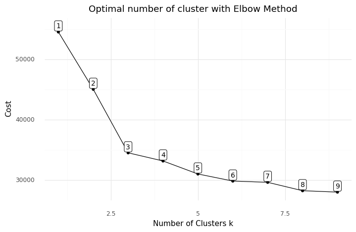
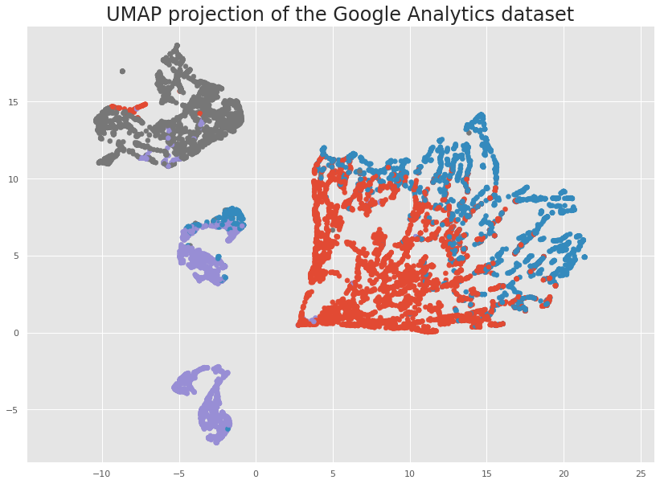

# Descrição do repositório

Este repositório armazena um notebook sobre K-Modes e K-Prototypes, que são dois algoritmos de clusterização. O notebook contém um estudo sobre esse tema desenvolvido no âmbito do grupo CiDAMO, com a orientação do Profº Lucas Pedroso. O notebook contempla:

```
1 Introdução
2 K-Modes
  2.1 Funcionamento
    Step 1: Tome K observações aleatórias para serem os líderes dos clusters
    Step 2: Calcule as dissimilaridades entre as observações e os líderes e atribua cada observação ao seu cluster mais próximo
    Step 3: Defina novos modos para os clusters
    Step 4: Repita os steps 2-3
  2.2 Implementação
3 K-Prototypes
  3.1 Funcionamento
    Step 1: Tome K observações aleatórias para serem os modos/líderes dos clusters
    Step 2: Calcule as dissimilaridades entre as observações e os modos/líderes e atribua cada observação ao seu cluster mais próximo
    Step 3: Redefinir os modos
    Step 4: Repita os steps 2-3
  3.2 Implementação
    3.2.1 Treinando o K-Prototypes
    3.2.2 Visualizando os resultados com UMAP
      Treinos para umaps
      UMAPS
4 Próximos passos
```

# Por que usar o K-Modes e o K-Prototypes?

Quando falamos em clusterização, o K-Means é o algoritmo mais famoso e utilizado. Alguns motivos para isso é que o K-Means costuma apresentar boa performance e é facilmente interpretável.

Porém, o K-Means faz a clusterização com base no cálculo de distância entre os pontos, ou seja, é uma técnica de clusterização para conjuntos de dados com variáveis numéricas. Quando temos variáveis categóricas, podemos transformar essas variáveis em numéricas e usar o K-Means, mas isso não é o ideal, até porque temos técnicas específicas para lidar com clusterização de conjuntos de dados com variáveis categóricas. Essas técnicas são o K-Modes e o K-Prototypes!

# K-Modes

O K-Modes é uma variação do K-Means que lida com conjunto de dados onde as variáveis são todas categóricas. Esse algoritmo faz isso substituindo o cálculo da distância pelo cálculo da dissimilaridade.

# K-Prototypes

O K-Prototypes é uma combinação do K-Means e do K-Modes. Essa técnica é ideal quando temos um conjunto de dados com variáveis tanto numéricas quanto categóricas. Com isso, para lidar com as variáveis numéricas o K-Prototypes prossegue usando o cálculo de distância, como o K-Means; por outro lado, para lidar com as variáveis categóricas, ele prossegue como o K-Modes, usando o cálculo da dissimilaridade

# Sobre o notebook

Temos abaixo o gráfico do cotovelo para o K-Modes:



Veremos como fazer esse gráfico e escolher o valor de K com base nele quando estamos lidando com dados categóricos na clusterização.

Abaixo temos o resultado do UMAP (uma técnica de redução de dimensionalidade) para uma clusterização de 4 clusters com o K-Prototypes. Veremos como fazer esse gráfico e como ele pode nos ajudar a interpretar os resultados da nossa clusterização.



Além disso, veremos o funcionamento detalhado dos algoritmos, como funciona o cálculo da dissimilaridade usada, entre várias outras coisas, sempre alternando entre explicação e implementação!
